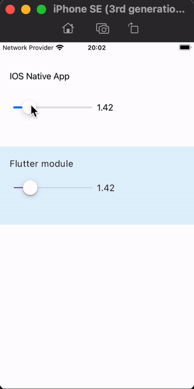
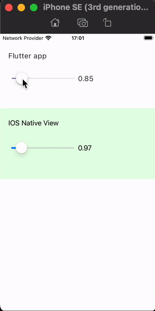

# Integrate a Flutter module into iOS app
### IOSFlutter + ios_flutter_module folders

Use the CocoaPods dependency manager and installed Flutter SDK. In this case, the flutter_module is compiled from the source each time the app is built. (Recommended.)

https://docs.flutter.dev/add-to-app/ios/project-setup

  

# Hosting native iOS views in Flutter app
### flutter_ios folder

Platform views allow you to embed native views in a Flutter app, so you can apply transforms, clips, and opacity to the native view from Dart.  

https://docs.flutter.dev/platform-integration/ios/platform-views

  